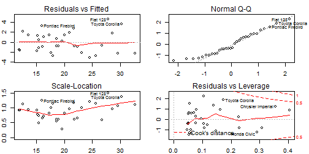

## Application Description

<b><u>Application Name:</b></u><br> Covariate Selection for MPG Prediction

<b><u>Application Location:</b></u><br> https://ibarshai.shinyapps.io/CourseProject/

<b><u>Application Purpose:</b></u><br>
The course project for the Linear Regression class required the student to identify answer questions about the mtcars dataset by selecting and analysing the best linear model for the prediction of the MPG variable in the dataset.

This application creates a quick way to play around with the covariate selection for the model and displays several key measures of the effectiveness of the model.

--- .class #id 

## Using the Application

<div id="nav">

</img>
</img>
</img>

</div>

<div id="section">

<p>To begin the modeling, you first select the singular variables you wish to include in the model. You do so by selecting them in the checkbox group on the left side panel.</p>

<p><br><br>Then you select the number of interaction terms you would like to include in the model. Selections for the interaction terms appear when this input is greater than 0.</p>

<p><br><br>Select the interaction terms by clicking multiple variables in the checkbox group.</p>

</div>

<style>
#nav {
    line-height:30px;
    width:300px;
    float:left;
    padding:5px; 
}
#section {
    width:500px;
    float:left;
    padding:10px; 
}
</style>

--- .class #id

## Example - Select Inputs

<div id="nav">

</img>

</div>

<div id="section">

<p>Let's say selections on the left were made in the side panel inputs.</p>

<p>With this input, we will be creating a linear model to predict the mpg variable constructed out of the horsepower term, weight term, as well as the interaction between these two terms. The expected formula for our model will be as follows:</p>

</div>

<style>
#nav {
    line-height:30px;
    width:300px;
    float:left;
    padding:5px; 
}
#section {
    width:500px;
    float:left;
    padding:10px; 
}
</style>

--- .class #id

## Example - Outputs


 


```
##             Estimate Std. Error t value  Pr(>|t|)
## (Intercept) 49.80842    3.60516  13.816 5.006e-14
## hp          -0.12010    0.02470  -4.863 4.036e-05
## wt          -8.21662    1.26971  -6.471 5.199e-07
## hp:wt        0.02785    0.00742   3.753 8.108e-04
```

```
## [1] "R squared: 0.884763711991139"
```

